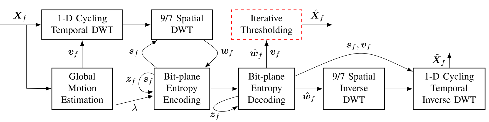
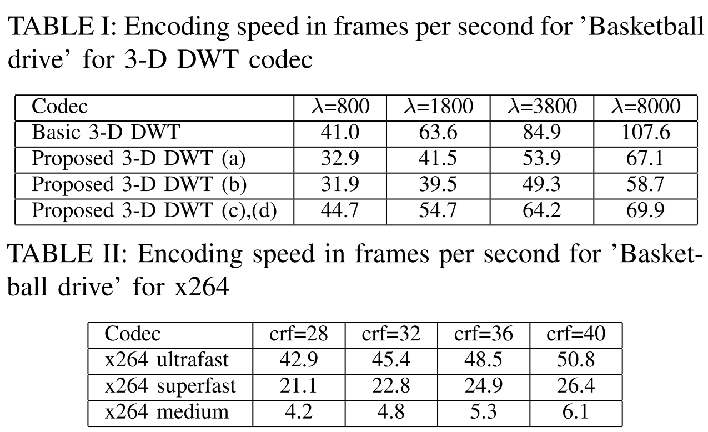

# An Efficient Wavelet Video Coding with Soft Decoding

## Introduction 
Currently,     hybrid     video     coding     represented     by H.264/AVC, H.265/HEVC and H.266/VVC video
coding standards and its commercial equivalents is the most widespread and developed video compression framework. On
the one side, it provides very high compression performance due  to  block-based  motion  compensation,  intra-prediction,
in-loop filter and other coding tools. On the other side, the parameters of these tools should be selected at the encoder
side, so that for real-time applications the parameters selection algorithms should be significantly simplified, resulting in a
decrease of its rate-distortion performance. As a result, the  compression  performance  becomes  comparable  with  an
alternative  video  compression  framework,  such  as  video coding based on 3-D DWT.

In our previous works we introduced the 3-D DWT codec which is from  2 to 6 times faster  than existing the fastest
implementation of H.264/AVC (x264 in ultrafast preset). Moreover,  the  3-D  DWT  video  coding  has  the  following
additional advantages:
- It  naturally  provides  temporal,  spatial  and  quality scalability without degradation in compression performance.
- It can provide low-complex multi-view video coding and rate-distortion optimized video multiplexing.
- It   supports   real-time   joint   source-channel   coding for  video  communication  over  channels  with  packet losses,  which  makes  it  efficient,  for  example,  for real-time vehicle-to-vehicle communications.
- It can be also improved due to learned wavelet transform approaches, such as learned motion-compensated
temporal  filtering  [10]  and  learned  wavelet  subbands compression [11].

The  main  disadvantage  of  the  3-D  DWT  video  codec  is  its  limited  rate-distortion  performance
compared to H.264/AVC, especially, at video sequences with medium  or  high  motion  level.  In  order  to  overcome  this
limitation, in this project  we propose to perform decoding via iterative shrinkage-thresholding algorithm
(ISTA). We first incorporate global motion compensation into the ISTA iterations. Second,
we  propose  to  use  the  randomized  3-D  DCT  thresholding  of  the  most  similar  blocks  patches,
which is more than 20 times faster than VBM3D thresholder. It  allows  to  perform
experiments for Full HD frame resolution.

## Performance comparison

According  to  Bjøntegaard  BD-Rate  metric,  the  proposed 3-D DWT codec with ISTA provides an average 27.9%
and 12.1% bit rate savings, in comparison with ultrafast and superfast  presets,  respectively,  and  only  5.9%  worse  than
medium  preset.  

Table I shows encoding complexity comparison measured in number of frames which can be encoded in one second with
CPU AMD Ryzen 9, 4.00 GHz. In all cases, the encoding speed was measured without any use of assemblers, threads,
or other program optimization techniques. Table II shows that the proposed 3-D DWT codec is around 1.0–1.4, 2.1–2.6 and 10.6–11.5 times faster than ultrafast, superfast and medium presets, respectively. As a result, we can conclude that the proposed 3-D DWT codec provides better compression performance and the encoding speed that the real-time presets ultrafast  and  superfast  of  x264,  while  the  medium  preset outperforms the proposed 3-D DWT codec only by involving much more computation operations.

## Reference
[1] E.Belyaev, K.Egiazarian, M.Gabbouj, A Low-Complexity Bit-Plane Entropy Coding and Rate Control for 3-D DWT Based Video Coding, IEEE Transactions on Multimedia, 2013. 
[2] E.Belyaev, A.Vinel, A.Surak, M.Gabbouj, M.Jonsson, K.Egiazarian, Robust vehicle-to-infrastructure video transmission for road surveillance applications, IEEE Transactions on Vehicular Technology, 2015. 
[3] Belyaev, K. Egiazarian, M. Gabbouj, and K. Liu, A low-complexity joint source-channel video coding for 3-d dwt codec, Journal of Communications, 2013. 
[4] E. Belyaev, S. Forchhammer, and M. Codreanu, Error concealment for 3-d dwt based video codec using iterative thresholding, IEEE Communications Letters, 2017.
[5] E. Belyaev, An Efficient Soft Decoding for Wavelet Video Compression with Global Motion Compensation, Digital Signal Processing and Its Applications — DSPA-2025, 2025. 